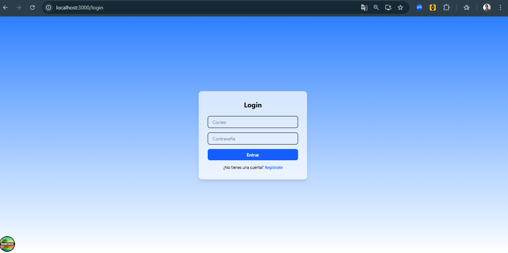
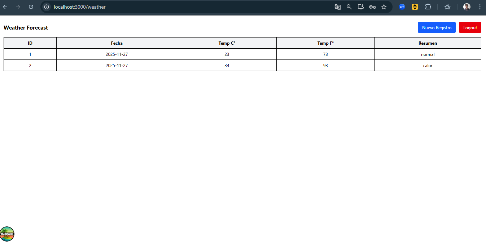
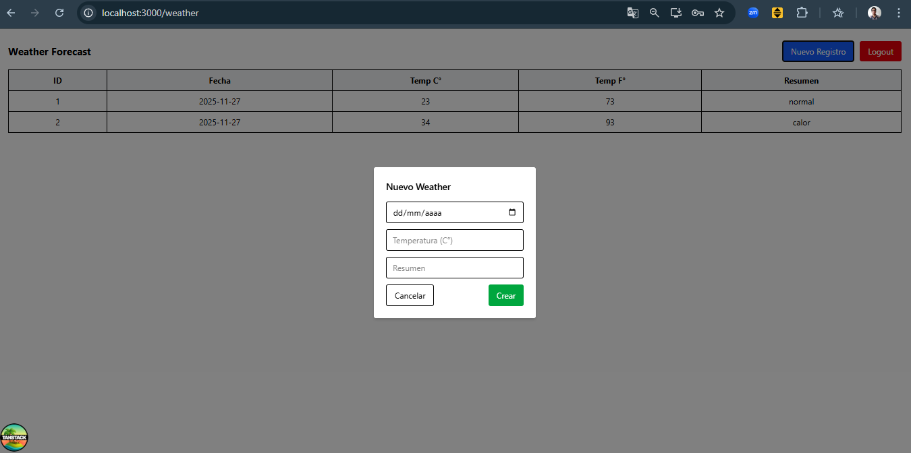

# 🌦️ Weather App – usuario + clima (Fullstack .NET + React)

Aplicación full-stack que permite registrar usuarios, iniciar sesión y gestionar registros de clima (WeatherForecast).  
Cada usuario tiene acceso únicamente a sus propios registros gracias a la autenticación mediante JWT.

---
## 🛠️ Instalación y ejecución del proyecto

### 🔹 1. Clonar el repositorio

```bash
git clone https://github.com/TU-USUARIO/TU-REPO.git
cd TU-REPO
```
🟦 Backend (.NET API)

📁 Ruta del backend:
```bash
/backend/Inventario
```
✔️ 2. Restaurar dependencias
```bash
cd backend/Inventario
dotnet restore
```
✔️ 3. Crear base de datos mediante migraciones

Si es la primera vez:
```bash
dotnet ef database update
```
⚠️ Requiere tener SQL Server en ejecución.
✔️ 4. Ejecutar backend
```bash
dotnet run
```

La API estará disponible en:
```bash
http://localhost:7002
```
🟩 Frontend (React + TanStack Router)

📁 Ruta del frontend:
```bash
/frontend
```
✔️ 5. Instalar dependencias
```bash
cd frontend
npm install
```
✔️ 6. Ejecutar en modo desarrollo
```bash
npm run dev
```
La aplicación estará en:

```bash
http://localhost:3000
```
## 📡 Endpoints del Proyecto


El backend expone una API REST protegida con JWT y con **CORS habilitado** para permitir las solicitudes del frontend React.  
Se configuró CORS para aceptar peticiones desde `http://localhost:3000` (origen del frontend), permitiendo los métodos necesarios (GET, POST, etc.) y el encabezado `Authorization` para el envío del token.


## 🔐 Autenticación (público)

### Registrar usuario
POST /register  
Body:
{
  "nombre": "Israel",
  "email": "correo@mail.com",
  "password": "123456"
}

### Iniciar sesión
POST /login  
Body:
{
  "email": "correo@mail.com",
  "password": "123456"
}  
Respuesta:
{
  "token": "<JWT_TOKEN>"
}

## 🌦️ WeatherForecast (requiere JWT)

Todas estas rutas requieren el header:
Authorization: Bearer <token>

### Listar registros del usuario
GET /weather

### Crear un nuevo registro
POST /weather  
Body:
{
  "date": "2025-01-01",
  "temperatureC": 28,
  "summary": "Nublado"
}

## 📋 Resumen de Endpoints
| Método | Ruta      | Auth | Descripción                           |
|--------|-----------|------|----------------------------------------|
| POST   | /register | No   | Registrar nuevo usuario                |
| POST   | /login    | No   | Iniciar sesión y obtener token         |
| GET    | /weather  | Sí   | Listar WeatherForecast del usuario     |
| POST   | /weather  | Sí   | Crear nuevo WeatherForecast del usuario |

<h1 align="center">Login</h1>



<h1 align="center">Register</h1>


<h1 align="center">Weather</h1>




<h2 align="center">🔎 Pruebas de Seguridad (OWASP)</h2>

<p align="center">
  <a href="./pruebas/OWAST.md">
    👉 Haz clic aquí para ver el documento completo de pruebas OWASP
  </a>
</p>