# 🌦️ Weather App — Pruebas y Funcionalidades

Este documento muestra las pruebas realizadas, incluyendo flujo de usuario, funcionamiento del sistema y validaciones contra ataques de inyección (OWASP A3).

Las imágenes utilizadas se encuentran en la carpeta `readme-images/`.

---

# 🔐 1. Registro de Usuario

## 📌 Vista del formulario de registro

  

## 📌 Registro exitoso

  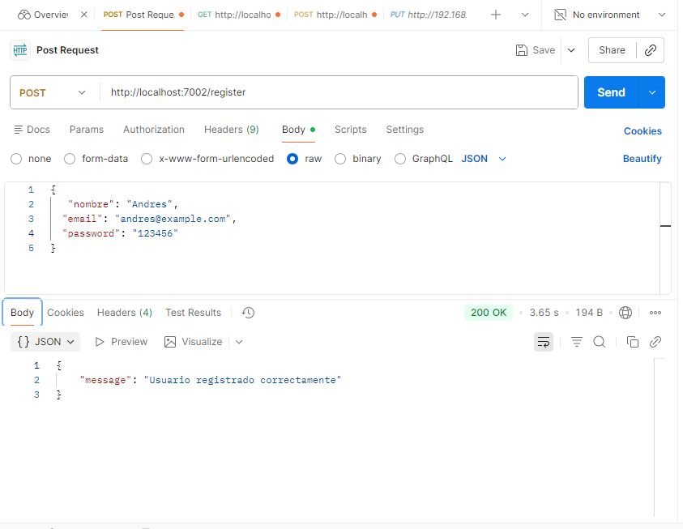

---

# 🔑 2. Inicio de Sesión (Login)

## 📌 Vista de login

  

## 📌 Prueba login usuario 1

  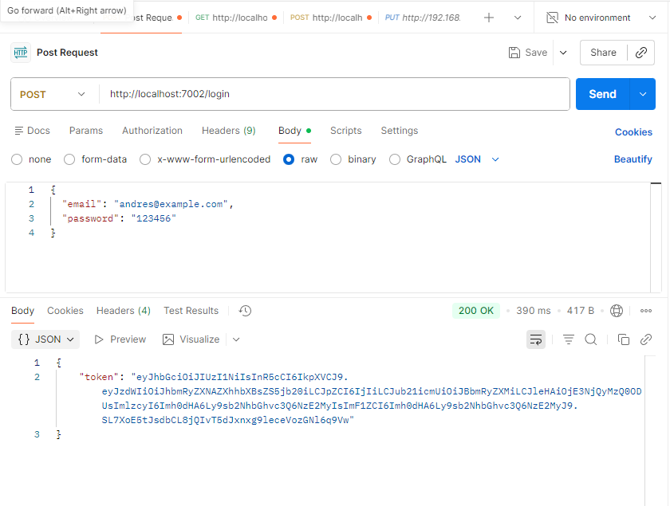

## 📌 Prueba login usuario 2

  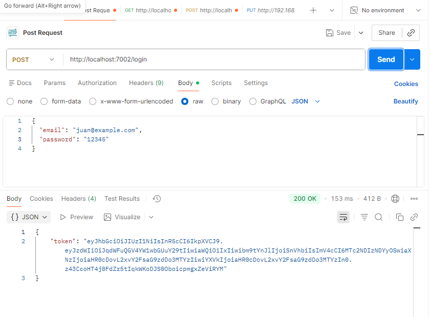

---

# 🌤️ 3. Consulta de Weather Forecast

## 📌 Vista del usuario consultando su propio Weather

  

## 📌 Segundo usuario mostrando su información

  

---

# 🔎 4. Consulta por ID — Weather por Usuario

## 📌 get_weather_user_1

  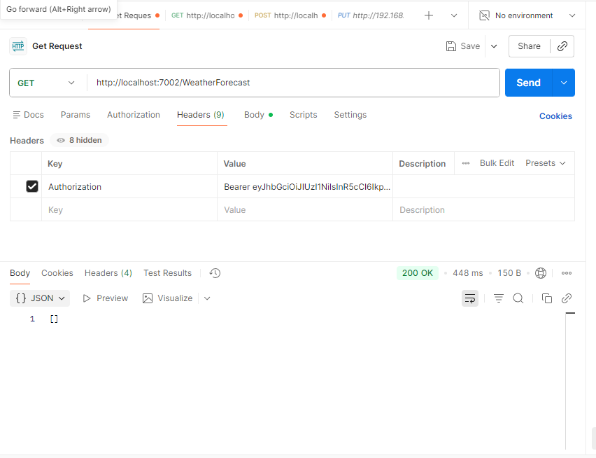

## 📌 get_weather_user_2

  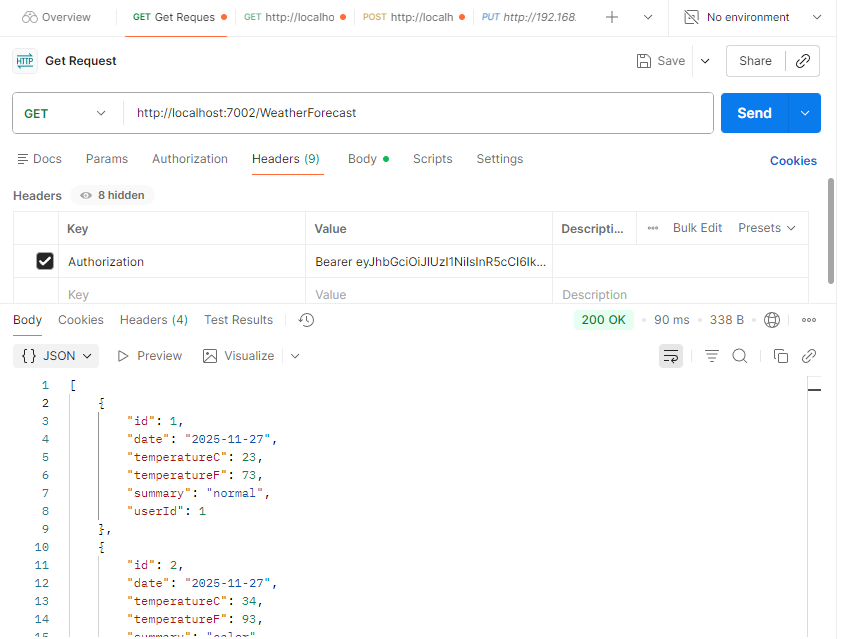

---

# 🛡️ 5. OWASP A3 — SQL Injection Tests

A continuación se muestran las pruebas realizadas para validar que el sistema **no es vulnerable a SQL Injection**, tanto en login, registro y creación de Weather.

---

## 🧪 5.1 Inyección en Login

### 1️⃣ Intento de inyección

  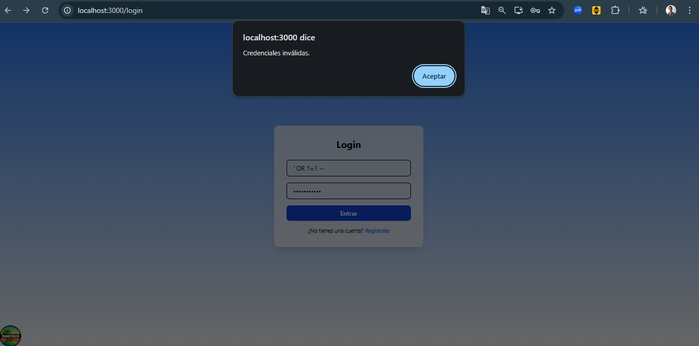

### 2️⃣ Resultado — No vulnerable

  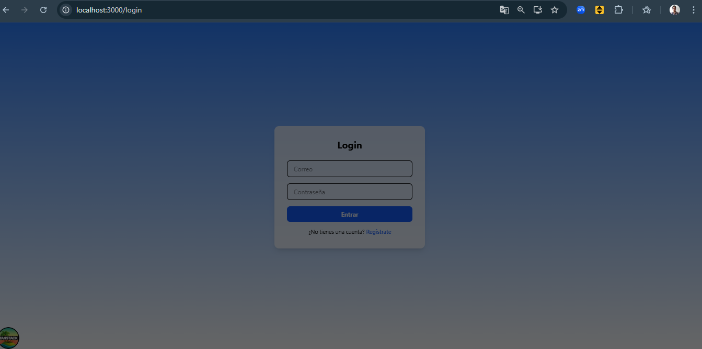

### 3️⃣ Otro intento

  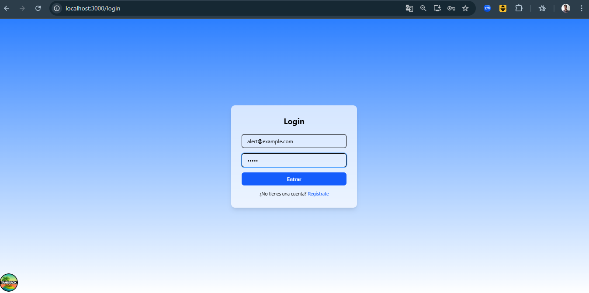

### 4️⃣ Último intento fallido

  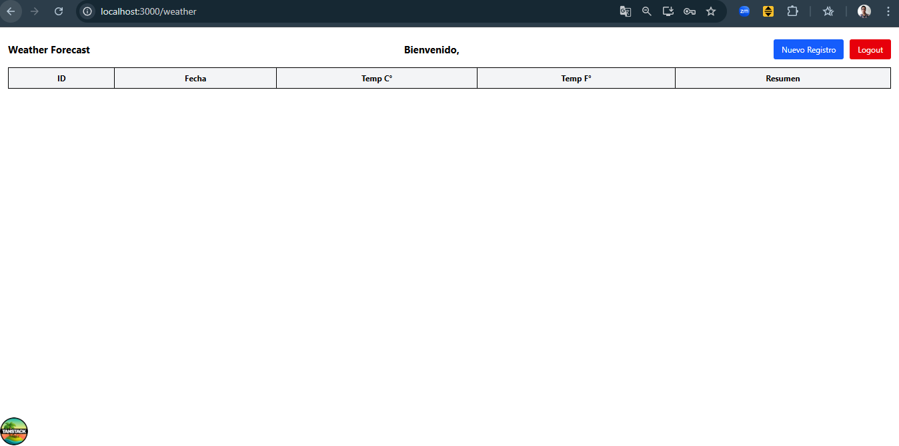

---

## 🧪 5.2 Inyección en Registro

### 1️⃣ Intento de inyección

  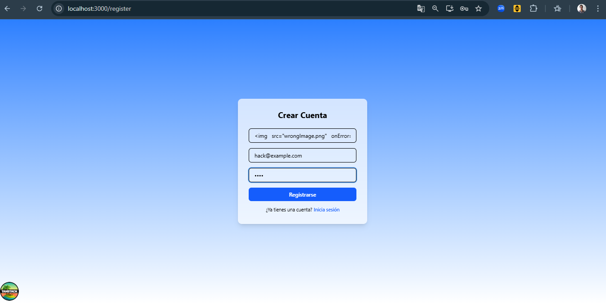

### 2️⃣ Resultado — Backend sanitiza correctamente

  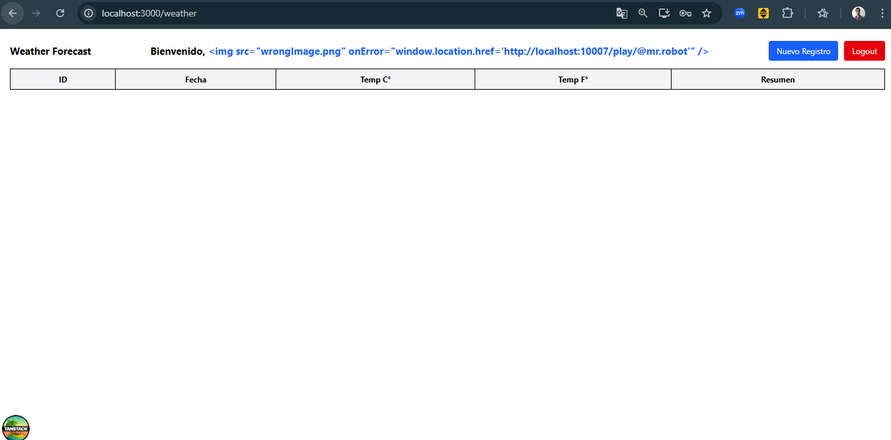

---

## 🧪 5.3 Inyección al crear Weather (POST /weather)

### Intento de inyección en los campos del Weather

  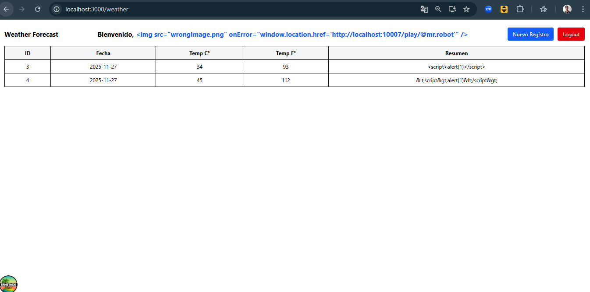

---

# 🏁 Conclusión

El sistema implementa:

- 🔐 Sanitización en backend (anti-XSS)
- 🛡️ EF Core parametrizado → evita SQL Injection
- ✔ JWT con validación fuerte
- ✔ CORS configurado correctamente
- ✔ Acceso por usuario (Broken Access Control mitigado)
- ✔ Validación completa del lado backend

Todas las pruebas de inyección fueron bloqueadas exitosamente.

---